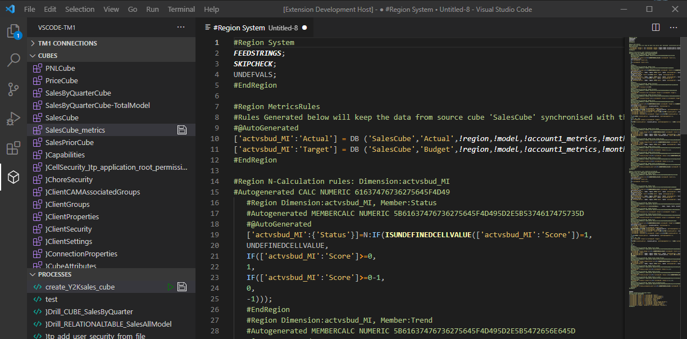
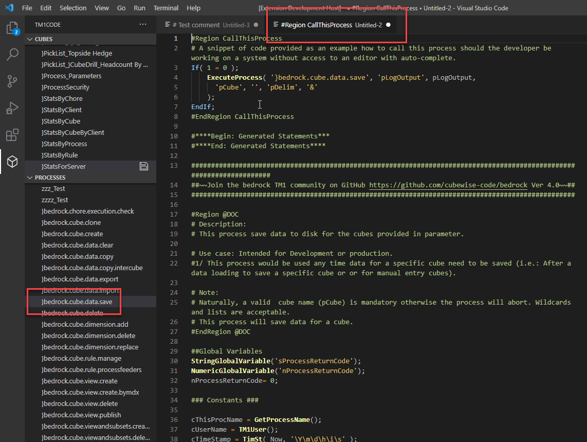

# vscode-tm1
A Visual Studio Code Extension for TM1

# What is this project?
`vscode-tm1` (name subject to change) is a Visual Studio Code extension that leverages the TM1 Rest/VS Code APIs to bring a more native coding experience to the TM1 development space. This project is built on top of concepts and ideas from other projects, and is largely driven by community feedback and needs. **vscode-tm1 is and always will be free.**

# What is the scope of this project?
- Rule editing and saving
- TI editing and saving
- Git integration
- Code snippets for rules and TIs
- Intellisense for rules and TIs




# I want to contribute, how do I start?
Awesome, let's get you setup with the basic tools and documentation.

This VS Code extension is written using [TypeScript](https://www.typescriptlang.org/docs/), which brings proper classes and strongly typed objects to the front-end space.  While traditional JavaScript will run perfectly fine in this environment, please try to make use of the benefits TypeScript brings as much as possible.

A few tools are needed to get up a running; primarly [Yeoman](https://yeoman.io/) and [VS Code Extension Generator](https://www.npmjs.com/package/generator-code).  You can get both of these tools by running:
```
npm install -g yo generator-code
```

Once everything is installed and this repo is cloned, you can edit the extension code by running:
```
code ./vscode-tm1
```

For more information on how to get started, see the [VS Code Extension: Getting Started](https://code.visualstudio.com/api/get-started/your-first-extension) guide.

# Submitting Pull Requests
Please try to keep patches small and focused on specific items.  For both clarity and self-documenting purposes, large patches are to be avoided whenever possible - although sometimes they will be necessary.
