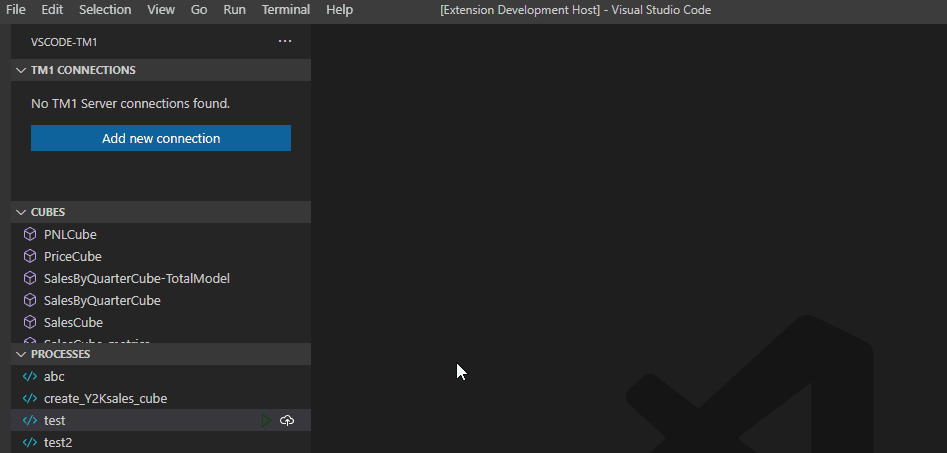
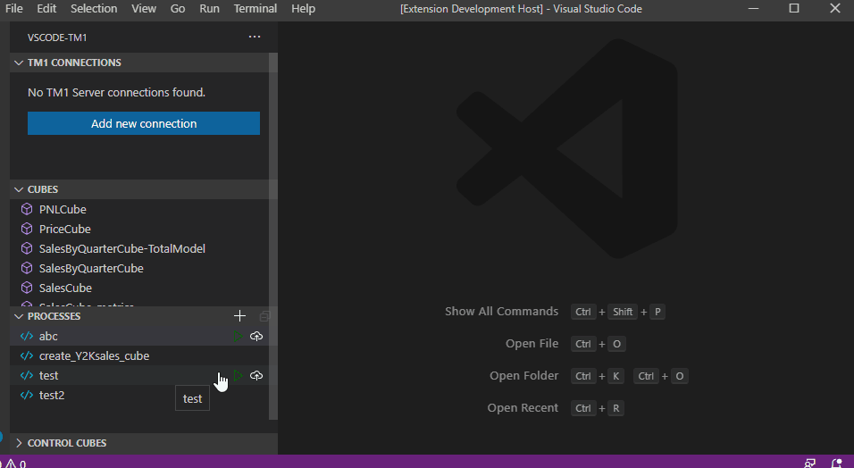

# vscode-tm1 (Alpha)
A Visual Studio Code Extension for TM1

# Important Note!
Please see [here](https://github.com/bgregs514/vscode-tm1/discussions/33) for an imporant update related to ongoing project development.

# What is this project?
`vscode-tm1` (name subject to change) is a Visual Studio Code extension that leverages the TM1 Rest/VS Code APIs to bring a more native coding experience to the TM1 development space. This project is built on top of concepts and ideas from other projects, and is largely driven by community feedback and needs. **vscode-tm1 is and always will be free.**

# What to expect
This project is currently in `alpha` stage.  Bugs are to be expected, but please report them as you come across them!

# What is the scope of this project?
- Rule editing and saving
- TI editing and saving
- Git integration
- Code snippets for rules and TIs
- Intellisense for rules and TIs




# Installing the extension (outside of developer mode)
You can test out the latest version of the vscode-tm1 extension in your regular VSCode editor by installing the included `.vsix` file using the following command:
```PowerShell
code --install-extension vscode-tm1-0.0.1.vsix
```
See [here](https://code.visualstudio.com/api/working-with-extensions/publishing-extension#packaging-extensions) for more details on how to install the extension.

# I want to contribute, how do I start?
Awesome, let's get you setup with the basic tools and documentation.  You can start by reading this project's [CONTRIBUTING](docs/CONTRIBUTING.md) page.

This VS Code extension is written using [TypeScript](https://www.typescriptlang.org/docs/), which brings proper classes and strongly typed objects to the front-end space.  While traditional JavaScript will run perfectly fine in this environment, please try to make use of the benefits TypeScript brings as much as possible.

A few tools are needed to get up a running; primarly [Yeoman](https://yeoman.io/) and [VS Code Extension Generator](https://www.npmjs.com/package/generator-code).  You can get both of these tools by running:
```
npm install -g yo generator-code
```

Clone the repo, enter into the `vscode-tm1` folder, open a PowerShell terminal (ensure the terminal session has a pwd inside the folder), and run:
```
npm install
```
This will install all of the node dependencies for the project.

Once everything is installed, you can edit the extension code going back to the root git folder (the one with the folder named `vscode-tm1` and running:
```
code ./vscode-tm1
```

For more information on how to get started, see the [VS Code Extension: Getting Started](https://code.visualstudio.com/api/get-started/your-first-extension) guide.

# Submitting Pull Requests
Please try to keep patches small and focused on specific items.  For both clarity and self-documenting purposes, large patches are to be avoided whenever possible - although sometimes they will be necessary.
